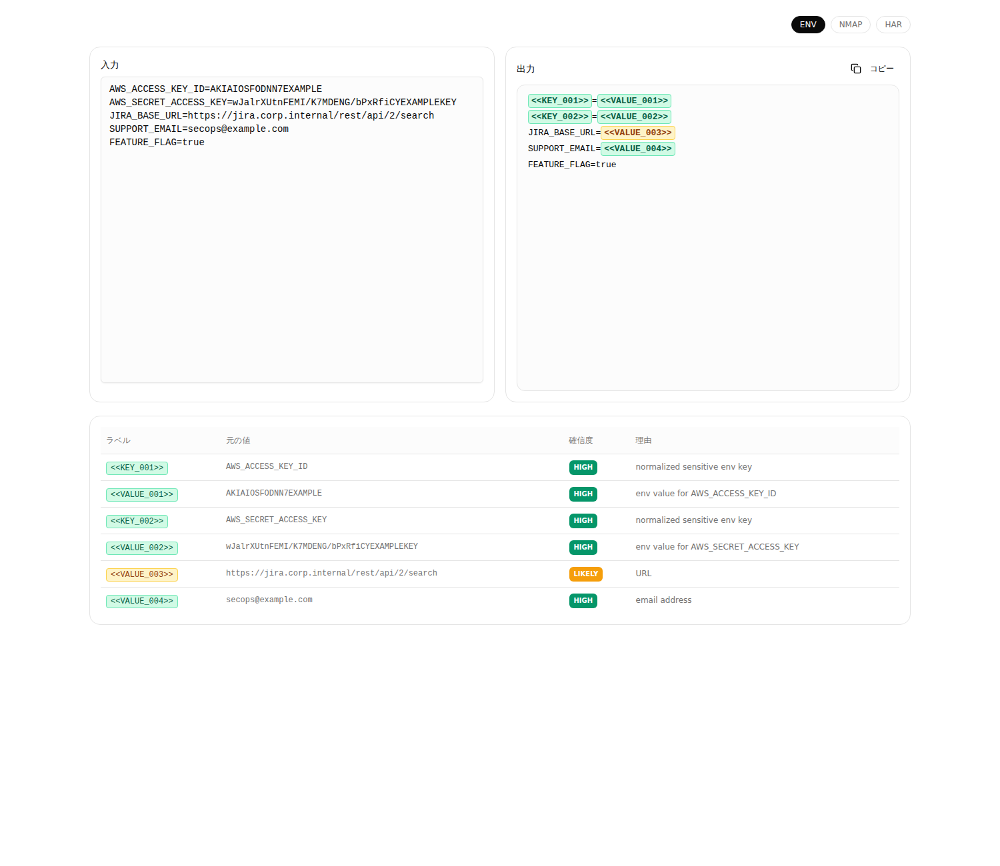
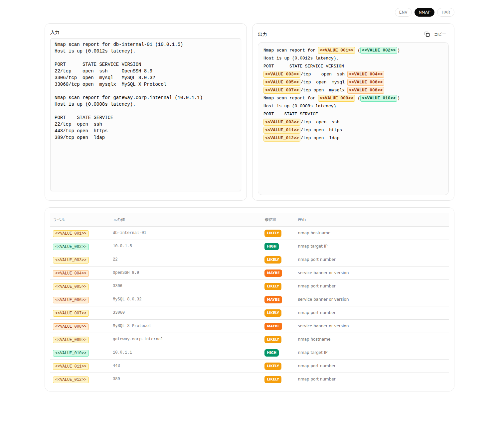
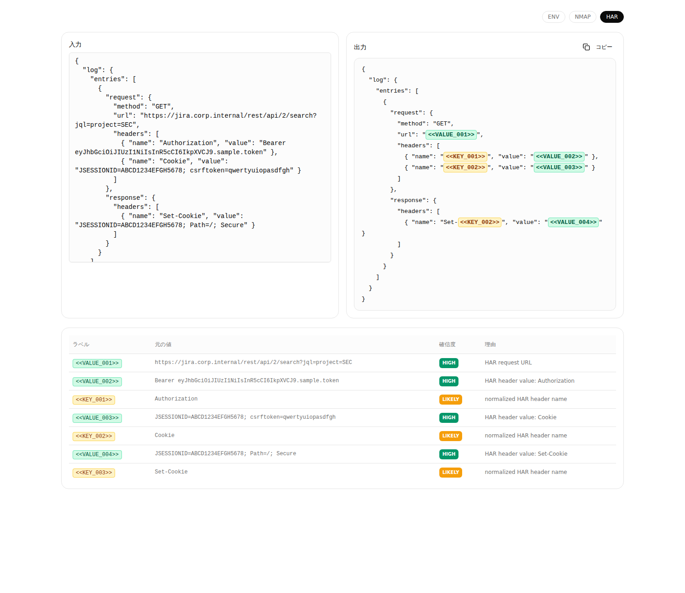

# Pentect PoC

`Pentect` は `.env`、`nmap` ログ、HAR を安全な形に変換するためのローカル PoC です。出力はマスク済み本文と対応表に絞っています。

```bash
bun i
bun dev
```

```bash
bun run screenshots -- --mirror-dir ../masking-engine
```

## Screenshots




